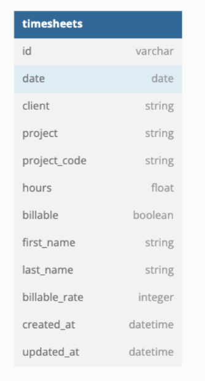

# TimeSheets
## Schema: 




This is a full-stack web application that uses [React](https://reactjs.org/) (version 8.3.1) for the frontend and [Rails](https://rubyonrails.org/) (version 5.2.8.1) for the backend.

## Getting Started

These instructions assume  you are using MacOS as your build environment and that you have basic understanding of using the terminal. <br> If you don't, email me at [alaina.noel.8@gmail.com](alaina.noel.8@gmail.com) and I'll walk you through it. 

To get started, you'll need to fork and clone both repositories.

1. Fork & Clone the frontend repository by clicking the "Fork" button at the top right of [this page](https://github.com/Alaina-Noel/time_sheets_fe).<br> Click Create Fork. And then run the following command in your terminal:

```
git clone git@github.com:YOUR-USERNAME/time_sheets_fe.git
```

1. Fork & Clone the backend repository by clicking the "Fork" button at the top right of [this page](https://github.com/Alaina-Noel/time_sheets_be). Click Create Form. And then run the following command in your terminal:

```
git clone git@github.com:YOUR-USERNAME/time_sheets_be.git
```

Now you'll need to run both servers at the same time.

1. To set up and run the backend server run the following commands from the terminal:

```
cd time_sheets_be
```
```
bundle install
```
```
rails db:{create,migrate}
```
```
rake load:all
```
```
rails -p 5000
```
1. In a second tab in your terminal, without closing the first, cd into the frontend app and run
```
npm start
```
A browser should pop up where you can view the data that already exists in the database as well as add new entries.

If a browser doesn't pop up, Once both servers are running, you can access the application by visiting [http://localhost:3000](http://localhost:3000).

Note: backend runs on port 5000 and frontend on 3000

# Available Endpoints

## Get Timesheet Entries
```
 get http://localhost:5000/api/v1/timesheets
```

### Expected Response

```
{
    "data": [
        {
            "id": "RD001",
            "project_name": "Ethereum",
            "client_name": "Anil",
            "total_hours": 158.54999999999995,
            "total_billable_amount": 0.0,
            "billable_hours": 0.0,
            "billable_percentage": 0.0
        },
        {
            "id": "DV002",
            "project_name": "Pharos",
            "client_name": "Olith",
            "total_hours": 522.0700000000002,
            "total_billable_amount": 42127.49999999999,
            "billable_hours": 520.0700000000002,
            "billable_percentage": 99.6
        },
        {
            "id": "GM001",
            "project_name": "Business Development",
            "client_name": "Prosaria",
            "total_hours": 184.71,
            "total_billable_amount": 0.0,
            "billable_hours": 0.0,
            "billable_percentage": 0.0
        },
        {
            "id": "GM005",
            "project_name": "Conference/Training",
            "client_name": "Prosaria",
            "total_hours": 65.85999999999999,
            "total_billable_amount": 0.0,
            "billable_hours": 0.0,
            "billable_percentage": 0.0
        },
        {
            "id": "GM006",
            "project_name": "Team Development (Non-Training)",
            "client_name": "Prosaria",
            "total_hours": 58.75,
            "total_billable_amount": 0.0,
            "billable_hours": 0.0,
            "billable_percentage": 0.0
        },
        {
            "id": "GM002",
            "project_name": "Admin/Legal",
            "client_name": "Prosaria",
            "total_hours": 79.00999999999999,
            "total_billable_amount": 0.0,
            "billable_hours": 0.0,
            "billable_percentage": 0.0
        },
        {
            "id": "GM003",
            "project_name": "Paid Time Off",
            "client_name": "Prosaria",
            "total_hours": 145.37,
            "total_billable_amount": 0.0,
            "billable_hours": 0.0,
            "billable_percentage": 0.0
        },
        {
            "id": "TM001",
            "project_name": "Roonder 3.0",
            "client_name": "Roonder Technologies LLC",
            "total_hours": 489.0799999999998,
            "total_billable_amount": 34190.1,
            "billable_hours": 488.42999999999984,
            "billable_percentage": 99.9
        },
        {
            "id": "BGC001",
            "project_name": "CLOB Rearchitecture",
            "client_name": "Twitri",
            "total_hours": 239.06999999999996,
            "total_billable_amount": 12437.500000000002,
            "billable_hours": 213.89000000000001,
            "billable_percentage": 89.5
        },
        {
            "id": "Audosis003",
            "project_name": "Project Wildfire",
            "client_name": "Audosis",
            "total_hours": 439.33999999999986,
            "total_billable_amount": 30516.499999999996,
            "billable_hours": 435.9499999999999,
            "billable_percentage": 99.2
        },
        {
            "id": "FSG03",
            "project_name": "Google Drive Integration",
            "client_name": "Meecee",
            "total_hours": 0.76,
            "total_billable_amount": 0.0,
            "billable_hours": 0.0,
            "billable_percentage": 0.0
        },
        {
            "id": "RD002",
            "project_name": "React Native",
            "client_name": "Anil",
            "total_hours": 35.94,
            "total_billable_amount": 0.0,
            "billable_hours": 0.0,
            "billable_percentage": 0.0
        },
        {
            "id": "GM017",
            "project_name": "Training",
            "client_name": "Prosaria",
            "total_hours": 30.840000000000003,
            "total_billable_amount": 0.0,
            "billable_hours": 0.0,
            "billable_percentage": 0.0
        },
        {
            "id": "RD003",
            "project_name": "Watchlist Demo",
            "client_name": "Anil",
            "total_hours": 100.58,
            "total_billable_amount": 0.0,
            "billable_hours": 0.0,
            "billable_percentage": 0.0
        },
        {
            "id": "GM018",
            "project_name": "Recruiting",
            "client_name": "Prosaria",
            "total_hours": 5.02,
            "total_billable_amount": 0.0,
            "billable_hours": 0.0,
            "billable_percentage": 0.0
        }
    ]
}
```

## Create A TimeSheet Entries
```
 post http://localhost:5000/api/v1/timesheets
 JSON Body Example: { "timesheet": { "project_code": "A1", "company_name": "Company A Name", "project_name": "Project A Company A", "billable": true, "hours":9.5, "first_name": "Alaina", "last_name": "Kneiling", "billable_rate": 90 } }   
```

## Expected Response if Successful
```
{
    "data": {
        "id": "A1",
        "type": "timesheet",
        "attributes": {
            "project_code": "A1",
            "hours": 9.0,
            "first_name": "Alaina",
            "last_name": "Kneiling",
            "billable": true,
            "billable_rate": 90,
            "company_name": "Company A Name",
            "project_name": "Project A Company A"
        }
    }
}
```

## Expected Response if Unsuccessful
```
{
    "error": "Someting went wrong. Check that you have passed in all parameters in the body."
}
```